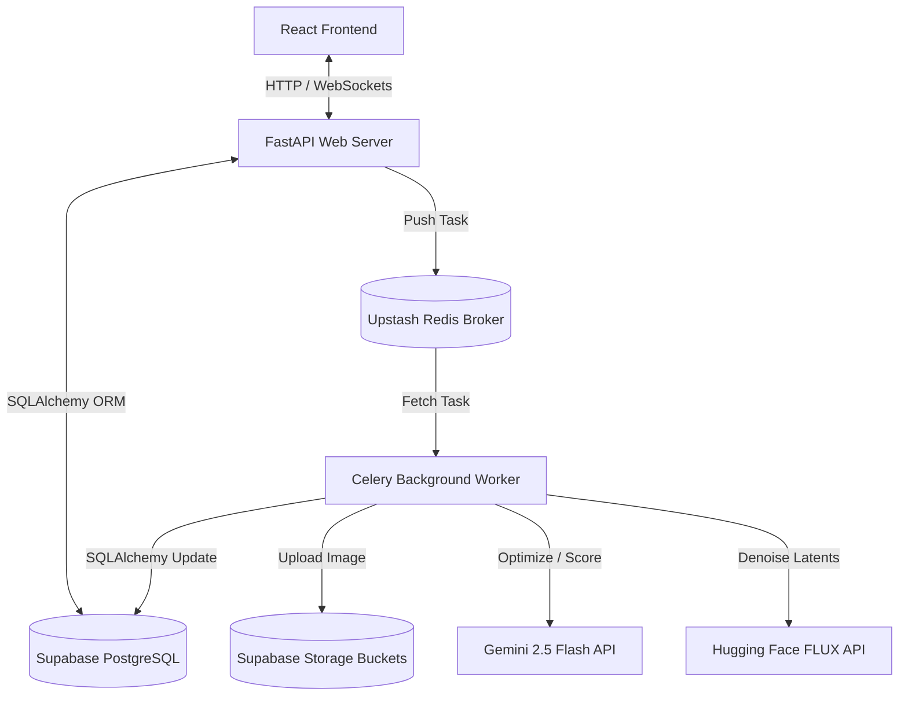
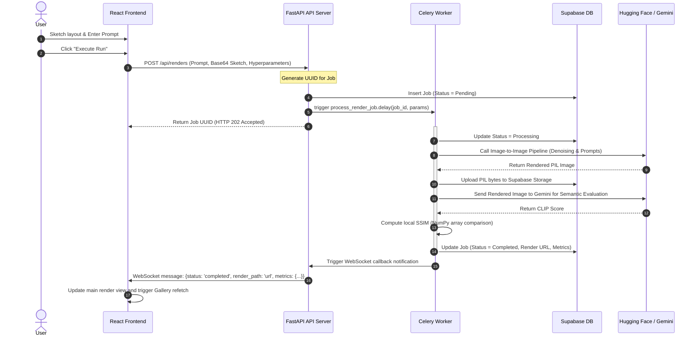

# System Architecture & Technical Flow 🏗️📊

This document details the system design, communication protocols, database schema, and end-to-end data flow of **Blueprint Studio AI**.

---

## 🗺️ 1. System Components & Networking

The system is split into three main decoupled layers:
1.  **Client Tier (Frontend)**: React (Vite) application rendering the canvas editor, setting sliders, and displaying real-time telemetry metrics and gallery updates.
2.  **API Tier (FastAPI)**: Handlers for prompt optimization, job submission, WebSocket connection routing, and history fetching.
3.  **Task Worker Tier (Celery + Redis)**: Out-of-band asynchronous processing for heavy computation (AI model invocation, image metrics calculation).

---

## 🔄 2. End-to-End Execution Lifecycle

The lifecycle of an image generation run is managed as follows:

---

## 🗄️ 3. Database Entity-Relationship (ER) Schema

The application uses two principal relational tables. Direct UUID casting is enforced throughout to guarantee compatibility with PostgreSQL.

### Users Table (`users`)
Keeps track of unique client IDs (frictionless browser-assigned sessions).
*   `id`: `UUID` (Primary Key, Defaults to `uuid_generate_v4()`)
*   `created_at`: `TIMESTAMP WITH TIME ZONE`

### Render Jobs Table (`render_jobs`)
Stores generation parameters, inputs, generated assets, and real-time metrics.
*   `job_id`: `UUID` (Primary Key, Defaults to `uuid_generate_v4()`)
*   `user_id`: `UUID` (Foreign Key -> `users.id`)
*   `prompt`: `TEXT`
*   `sketch_path`: `TEXT` (Public Supabase storage URL of the drawn canvas sketch)
*   `render_path`: `TEXT` (Public Supabase storage URL of the AI output)
*   `status`: `VARCHAR(50)` (Pending, Processing, Completed, Failed)
*   `control_strength`: `DOUBLE PRECISION` (Denoising strength factor)
*   `steps`: `INTEGER` (Denoising steps)
*   `cfg_scale`: `DOUBLE PRECISION` (Classifier-Free Guidance scale)
*   `metrics`: `JSONB` (Stores `ssim` and `clipScore` keys)
*   `created_at`: `TIMESTAMP WITH TIME ZONE`

---

## 📡 4. WebSocket Connection State Management

*   **Endpoint**: `ws://127.0.0.1:8000/ws/{client_uuid}`
*   Upon loading the page, the frontend establishes a persistent connection.
*   The API server maps active connection connections in a thread-safe `ConnectionManager` dictionary: `{ client_uuid: WebSocket }`.
*   When a background worker finishes a rendering task, it sends an update request or direct callback notifying the corresponding WebSocket channel.
*   If a user closes the browser or disconnects, the API server cleanly removes their socket from memory to prevent memory leaks.
